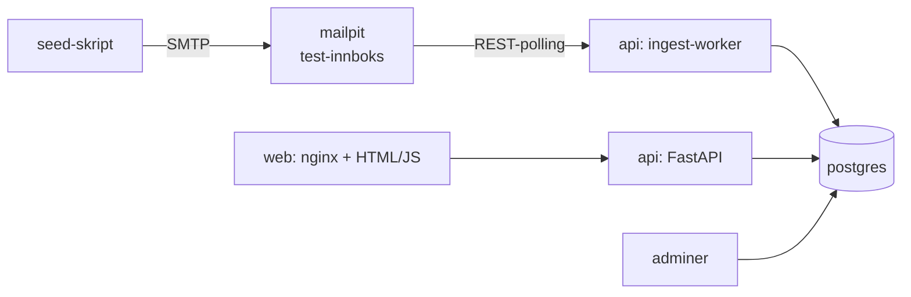

# JDD kunnskapsdatabase – prototype

Kjørbar demo for studentprosjektet i IS-219 (UiA) for JDD Utstyr. Den viser hvordan
kundeservice-e-poster blir til **anonymiserte, godkjente artikler** i en kunnskapsdatabase,
som kundesenteret kan søke i og en chatbot kan svare ut fra.

> **All data er oppdiktet.** Produkter, kunder, e-poster og SKU-er (`DEMO-001` …) finnes ikke.
> Ingen ekte kundedata skal inn i systemet.

## Oppstart

Krever Docker Desktop (eller Docker Engine med Compose).

```sh
cp .env.example .env               # 1. innstillinger (kan brukes uendret)
docker compose up --build          # 2. starter alle tjenestene
docker compose run --rm seed       # 3. i et nytt terminalvindu: sender 10 testeposter
```

Åpne deretter:

| Adresse | Hva |
|---|---|
| http://localhost:8080 | Nettsiden: Dataflyt, Godkjenning, Kunnskapsbase og Chatbot |
| http://localhost:8025 | Mailpit, test-innboksen som etterligner kundesenterets e-post |
| http://localhost:8081 | Adminer, som viser tabellene direkte (system *PostgreSQL*, server `db`, bruker/passord/database `jdd`) |
| http://localhost:8000/docs | Automatisk API-dokumentasjon (FastAPI) |

Stopp med `Ctrl+C` eller `docker compose down`. `docker compose down -v` sletter også
databasen, slik at den bygges på nytt fra `db/init.sql` og `db/seed.sql` neste gang.

### KI-modus eller regelmodus

Prototypen virker **uten API-nøkkel** (regelmodus). Da brukes regulære uttrykk og enkle regler.
Setter du `ANTHROPIC_API_KEY` i `.env` og starter på nytt (`docker compose up -d`), brukes
Claude (`LLM_MODEL`, standard `claude-sonnet-5`) til:

- en ekstra anonymiseringsrunde etter reglene (modellen ser aldri rå tekst),
- uttrekk av produkt, problem og løsning, og
- chatbot-svar formulert ut fra artiklene.

Hvis et KI-kall feiler, brukes regelmodus automatisk, og det står i hendelsesloggen.
Merket øverst til høyre på nettsiden viser hvilken modus som er aktiv.

## Slik virker det



Workeren sjekker innboksen hvert 10. sekund (`POLL_INTERVAL_SECONDS`) og kjører hver ny
e-post gjennom fem steg. Hvert steg skriver en rad i `pipeline_events`, som vises i Dataflyt-fanen:

1. **Mottatt.** E-posten hentes fra Mailpit. Meldinger som allerede er behandlet, hoppes over.
2. **Anonymisert.** Navn i hilsen og signatur, e-post, telefon, ordrenummer og adresse
   erstattes med `[NAVN]`, `[E-POST]`, `[TELEFON]`, `[ORDRE]` og `[ADRESSE]`.
   Dette skjer *før* noe lagres; rå e-post lagres aldri.
3. **Uttrekk.** Produkt (SKU eller produktnavn), problem og løsning.
4. **Duplikatsjekk.** `pg_trgm` sammenligner problemet med artikler for samme produkt.
   Er likheten minst `DUPLICATE_THRESHOLD` (0,4), foreslås en **oppdatering** av den
   artikkelen. Ellers foreslås en **ny** artikkel.
5. **Forslag.** Lagres som «venter». Ingenting skrives til `knowledge_articles` før en ansatt
   godkjenner. Ved godkjenning av en oppdatering øker artikkelens versjonsnummer.

| Mappe | Innhold |
|---|---|
| `db/` | `init.sql` (skjema) og `seed.sql` (10 produkter og 3 godkjente startartikler) |
| `api/app/` | `main.py` (ruter), `worker.py` (pipelinen), `anonymize.py`, `extract.py`, `duplicates.py`, `search.py`, `chat.py`, `review.py` (godkjenning) |
| `api/tests/` | Tester for anonymisering og duplikatsjekk |
| `web/` | Nettsiden: `index.html`, `app.js`, `style.css` (ingen byggesteg) |
| `seed/` | `send_emails.py` og 10 oppdiktede e-posttråder i `emails/` |

## Tester

```sh
docker compose run --rm api pytest            # alle testene
docker compose run --rm api pytest -k pii -v  # bare personvern-testene
```

Testene sjekker blant annet at **ingen navn, e-postadresser, telefonnumre eller ordrenumre fra
testdataene** finnes etter anonymiseringen. Hver testepost har en liste `test_pii` med
opplysningene som skal bort. `test_no_pii_in_database` sjekker hele databasen, så kjør den
etter `seed`. Uten data hoppes den over.

## Demo-manus (5 minutter)

Forberedelse: `docker compose up --build`, åpne http://localhost:8080 og trykk **Nullstill demo**.
Ha Mailpit (http://localhost:8025) og Adminer (http://localhost:8081) klare i egne faner.

**1. Problemet (30 s).** Hos JDD blir løsninger liggende i e-poster og kommer ikke inn i
kunnskapsdatabasen. Kunnskap forsvinner når erfarne folk slutter. Vis de **3 artiklene** i
*Kunnskapsbase*: det er alt databasen vet i dag.

**2. E-poster kommer inn (1 min).** Kjør `docker compose run --rm seed`. Vis e-postene i
Mailpit: de inneholder oppdiktede navn, telefonnumre og ordrenumre. Bytt til *Dataflyt*. Innen
et par sekunder vises hendelsene steg for steg med farger: Mottatt → Anonymisert → Uttrekk →
Duplikatsjekk → Forslag.

**3. Personvern (1 min).** Åpne *Godkjenning* og et forslag. Til venstre ser du e-posten slik
den er lagret: `[NAVN]`, `[TELEFON]`, `[ORDRE]` og `[ADRESSE]` i stedet for personopplysninger.
Vis gjerne tabellen `email_items` i Adminer: rå e-post finnes ikke i databasen.

**4. Godkjenning og duplikatsjekk (1 min 30 s).** Skriv inn navnet ditt. Åpne «Lysbjelke
flimrer ved motorstart», som er merket **Oppdatering** med høy likhetsprosent. Vis den
eksisterende artikkelen til høyre, rediger løsningen litt og trykk **Godkjenn**. Artikkelen går
til versjon 2. Åpne deretter «Blinklyset blinker for fort», der produktet ikke ble gjenkjent.
Godkjenn den som ny artikkel. Avvis ett forslag med en begrunnelse. Vis i *Dataflyt* at alt er
logget med navn.

**5. Bruk av kunnskapen (1 min).** *Kunnskapsbase*: søk etter «flimrer» og vis versjon 2 og
hvem som godkjente. *Chatbot*: spør «Hvorfor flimrer lysbjelken når jeg starter bilen?». Svaret
viser hvilken artikkel det bygger på. Spør så om noe som ikke finnes (f.eks. «Hva koster frakt?»);
chatboten sier fra i stedet for å finne på et svar.

**Avslutning.** Ingenting kommer inn i databasen uten at en ansatt har godkjent det, og
personopplysninger fjernes før noe lagres. Trykk **Nullstill demo** for å kjøre demoen på nytt.

## Begrensninger

- Prototypen er ikke koblet til JDDs ekte e-post, Multicase eller Shopify.
- Ingen innlogging. Ansattnavnet skrives inn i nettleseren og lagres der.
- Regelbasert anonymisering fanger navn i hilsen og signatur, men ikke nødvendigvis et navn
  midt i en setning. KI-modus gir en ekstra vask, men en ansatt må alltid lese forslaget før
  godkjenning.
- Regelmodus kopierer kundens og kundeservicens formuleringer. I KI-modus skrives problem og
  løsning mer generelt.
